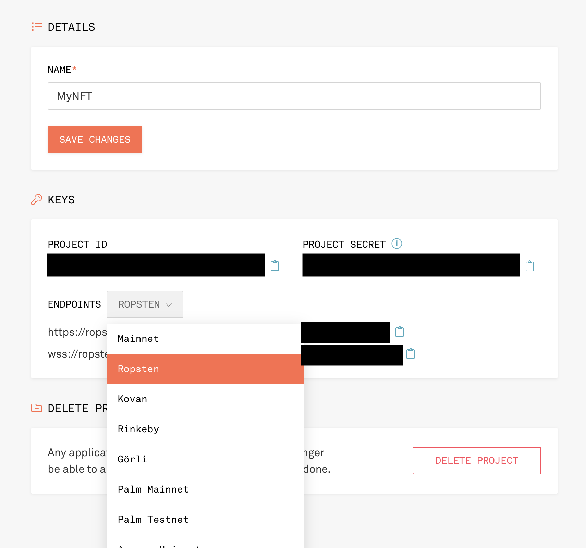

# NFT-Crash-Course

How does this apply to APIs?

- Learn and create an NFT in under 20 minutes!
- Add to some API that deals with lending markets?

Our target audience is experienced web2 devs discovering web3.

## Module 1: Overview

### Tutorial Overview

We will be covering how to build and launch a non-fungible token (NFT) in under 20 minutes. You will also get a hands-on tour of the web3 developer tooling to create decentralized applications on Ethereum.

We hope to inspire your imagination and aid your experimentation with new types of businesses and services using Ethereum Virtual based smart contracts.

What can you build with tools that easily create and scale coordination networks to millions of people?

#### Ethereum: Reliable and Composible APIs

As a web2 developer, why should we care about web3?

Ethereum offers something that application developers of all types can appreciate: a plaftform to create and leverage open and consistent APIs and datasets without permission.

**Always on:**  
You can rely on an Ethereum based API without ever worrying about being sunset. With web2, you are at the mercy of the team continuing to host the API on a third party server. With Ethereum, as long as one node in the blockchain network exists the deployed codebase will as well. Web2 history is littered with shutdown APIs that pull the rug on teams who built on top.

**Always available:**  
You can build on other people's smart contracts confidently without asking for permission. With web2, your access to an API can be turned off at any time, like what happened to third party Twitter developers early in its life. Due to the open nature of the blockchain data, there is no risk of losing access to your datasets.

Sometimes web2 services experience downtime on the service. With Ethereum, due to incentives built into the protocol, there is a high degree of decentralization resulting in the lack of reported network outages.

**Consistency:**  
Once deployed, the smart contract based API will not change. Due to the immutability of smart contracts, developers can build on top of an API and know it will operate exactly like the first time. There are cavets which can allow for upgrading of parameters and contracts logic, however smart contract code is available for all to read and anticipate future changes.

**Interoperability, open to all:**  
You can access the dataset of other smart contracts—no need to ask permission to extend another project's utility. Developers can easily mix and match different standaradized smart contract APIs to create new possibilities. Users can easily migrate their data between different codebases located on the same chain.

**Programmable scarcity:**
Abundance is fantastic. However, they don't allow us to model the real world without trusting intermediaries to enforce limits. Blockchains enforce scarcity and any arbitrary business logic without the need to trust a central intermediary. They impartially process any business logic without special interest. This allows us to create new types of collaboration methods not seen before.

### Concepts Overview

#### Blockchains

A single blockchain is like a linked list that is connected by the hash of the previous block of information. By hashing blocks and linking them together, they increase the difficulty of manipulation.

A blockchain network is when this blockchain is spread across various nodes for redundancy. The more decentralized the network, the more tamper-resistant the network. This increases trust in the system, which reduces the need for trust between entities. Through a consensus mechanism, the network's state is constantly updated.

In a sense, a blockchain is a database AND a network rolled up into one.

The blockchain's key innovation is to commoditize trust and allow for coordination between peers in open adversarial environments.

### Ethereum

Ethereum is the leading programmable blockchain. Due to its high degree of decentralization, immutability, programmability, and extensibility, Ethereum is the prime place to create and leverage highly reliable APIs, especially around value transfer.

Ethereum's smart contracts allow for the creation of reliable APIs which can enforce dealings with counterparties in a programmatic manner.

### Smart contract

Programmable pieces of code which run on the Ethereum blokchain.

### NFT

A nonfungible token (NFT) is a digital asset that represents a unique item. It is created from the ERC-721 standard and highlights what type of functionality and interface the underlying smart contract will contain.

#### IPFS

Interplanetary file storage (IPFS) is a A peer-to-peer hypermedia protocol. It is an alternative to HTTPS for the decentralized web.

#### MetaMask

MetaMask is a cryptocurrency wallet. It provides a simple and most secure way to connect to blockchain-based applications.

#### Infura

The world-leading Ethereum infrastructure provider. Infura allows developers to access and scale their decenralized applications on Ethereum, without needing to manage their own nodes.

#### Truffle

Truffle is a smart contract development environment for Ethereum Virtual Machine (EVM) based networks.

## Module 2: Setup

In this section, we will walk through setting up your development environment.

### Prerequisites

You must setup:

- [NodeJS](https://nodejs.org/en/) version 16 or above
- [Visual Studio Code](https://code.visualstudio.com/)
- [Git Bash](https://git-scm.com/downloads)
- [Bash on VS Code](https://www.shanebart.com/set-default-vscode-terminal/)

### MetaMask Setup

First, install MetaMask on your browser. If you are already a MetaMask user, its suggested to create a new browser profile for development purposes and install a seperate instance of MetaMask.

See this article to create a [new Chrome profile](https://pureinfotech.com/add-new-user-profiles-google-chrome/), [Firefox](https://www.wikihow.com/Create-a-Firefox-Profile) or [Brave Browser](https://community.brave.com/t/brave-multi-user-accounts/119425).

Go to [https://metamask.io/download/](https://metamask.io/download/)] and choose your browser.

Set up your wallet. **Remember to save your secret recovery phrase in a secure location**. Due to how blockchains are created, secret recovery phrase CANNOT be reset. Since MetaMask is a non-custodial wallet, they do not hold a copy for you.

### Infura Setup

Next, you will need to [set up a free account with Infura](https://infura.io/register).


Next, select a project. We will create two projects.
First, select Ethereum project.


Choose the Ropsten Test Network



Access your credentials. The project ID can be akin to your username, and the project secret a password.


Next, create a new project and choose IPFS.
You will save both these credentials into an .env file.


**TODO: Fix**  
Your IPFS API endpoint is...  
The dedicated gateway is ...  
The subdomain is ...

**TODO: FIX**  
Add config to upload things to IPFS

### Truffle Project Setup

Now, let's set up our directory.

First, let's create the repository. After selecting your desired directory to create the project, in your terminal run:

Create the directory folder.

```bash
mkdir NFT-Crash-Course
```

Initalialize Truffle

```bash
npx Truffle init
```

Create a .env file for your Infura Credentials

```bash
touch .env
```

Within the same folder add a node project. Step through the questions in the initial setup by pressing enter to add the defaults.

```bash
npx yarn init
```

Add dotenv to manage environment files

```bash
npx yarn add dotenv
```

Open the config file

```bash
open .env
```

Get a mnemonic by running the following code. Copy and paste this into `.env` file.

```bash
npx mnemonics
```

Add the Infura credentials

```text
MNEMONIC= Add your 12 word secret phrase that accessess your assets on Ethereum. Never share these! Wrap in qoutations.

INFURA_PROJECT_ID= Add your secret here. (No qoutations)
INFURA_PROJECT_SECRET=Add your ID here. (No quotations)

INFURA_IPFS_PROJECT_ID= Add IPFS project id (No qoutations)
INFURA_IPFS_SECRET= Same for IPFS secret (No qoutations)
```

If you are using git, let add a .gitignore file to omit the inclusion of unnecessary files.

```bash
touch .gitignore
```

At the top of the `.gitignore` file add the following

```text
# environment files
.env

# Mac OS files system - if mac users
.DS_Store
```

Below that text, add [following code](https://github.com/github/gitignore/blob/main/Node.gitignore) to the `.gitignore` file.

### Truffle Config

Next, lets set up our Truffle. The following command will setup our the scaffold files for our smart contract development environment.

```bash
npx truffle init
```

Next let's add the hierarchical deterministic wallet (HD Wallet) which will hold our keys in our project to access the network via Infura.

Additionally, we will add `ethersJS`, a javascript library that allows us to easily interact with the Ethereum blockchain.

```bash
yarn add @truffle/hdwallet-provider ethers@^5.0.0 node-fetch@2
```

Next let's configure our Truffle set up. This will allow us to connect Truffle to Infura and access the Ethereum Network.

This particular network, `Ropsten`, is test network. Test networks are used to deploy contract for testing for free. This allows developers to experiment with contracts with conditions that mirror the Ethereum Mainnet where Ether is worth real money.

Open `truffle.config.js` and add the following code:

```javascript
// add at the top of truffle.config.js

require("dotenv").config(); // allows usage of .env file to store secrets
const HDWalletProvider = require('@truffle/hdwallet-provider'); // holds secret mnemonic for your Ethereum address
const infuraURL = 'https://ropsten.infura.io/v3/' + INFURA_PROJECT_ID; // end point to join network
const mnemonic = process.env.MNEMONIC;

//...
// inside networks portion.
networks: {
  ropsten: {
        provider: () => new HDWalletProvider (mnemonic, infuraURL),
      network_id: 3,
      gas: 5500000,
      confirmations: 2,
      timeoutBlocks: 200,
      skipDryRun: true
      },
}

//...
```

Next up lets add the OpenZeppelin Contracts. OpenZeppelin is a library for secure smart contract development. It allows developers to build on a solid foundation of community-vetted code.

This is very important because smart contracts can hold enormous amounts of value and are immutable.

```bash
npx yarn add @openzeppelin/contracts
```

Finally, let get some free Ether for our test network. Ether is needed to process transactions on the blockchain.

Ether is required because:

- Without it, public networks accessible by all would run into DDOS attacks.
- Being able to upload arbitraty logic opens up the network to the the halting problem.
- independent network operators require incentivization to process computation on the network and pay for their operating costs.

Luckily, for our test networks, Ether is free.

Go to [faucet.paradigm.xyz/](https://faucet.paradigm.xyz/) and add your address to claim Ropsten Ether.

### Front End

Let's setup our client front-end within the same repository. We will call it `/client`.

```bash
npx create-react-app client
```

Navigate inside the `/client file` and initialize yarn. Additionally, add tailwind to help create a simple user interface.

```bash
npx yarn init -y && yarn add tailwind
```

## Module 3: Code Time

### Smart Contracts Walkthrough

Our focus for this tutorial will be on smart contracts and interacting with them.

#### Migration

`Migrations.sol` keeps track of our smart contract migrations to the chain. No edits are required here.

Each smart contract has a deployment script which we will explore later.

#### NFT contract

Let's create our NFT Contract!

Run the following command to create a new contract

```bash
npx truffle create contract MyNFT
```

Within `MyNFT.sol, add the following code

```solidity
// SPDX-License-Identifier: MIT
pragma solidity ^0.8.0;

import "@openzeppelin/contracts/token/ERC721/ERC721.sol";
import "@openzeppelin/contracts/utils/Counters.sol";

contract MyNFT is ERC721 {
  using Counters for Counters.Counter;

  Counters.Counter private currentTokenId;

  /// @dev Base token URI used as a prefix by tokenURI().
  string public baseTokenURI;

  constructor() ERC721("NFTTutorial", "NFT") {
    baseTokenURI = "";
  }

  function mintTo(address recipient) public returns (uint256) {
    currentTokenId.increment();
    uint256 newItemId = currentTokenId.current();
    _safeMint(recipient, newItemId);
    return newItemId;
  }

  /// @dev Returns an URI for a given token ID
  function _baseURI() internal view virtual override returns (string memory) {
    return baseTokenURI;
  }

  /// @dev Sets the base token URI prefix.
  function setBaseTokenURI(string memory _baseTokenURI) public {
    baseTokenURI = _baseTokenURI;
  }
}
```

Now that we have our contract, let's compile it into EVM Bytecode for eventual deployment.

```bash
npx truffle compile
```

#### Deployment

Let's now write the script for deployment to the Ropsten test network.

Navigate to the root of your project directory and create the `2_deployNFT.js` file.

```bash
touch ./migrations/2_deployNFT.js
```

Inside 2_deployNFT.js add:

```javascript
var MyNFT = artifacts.require("MyNFT");

module.exports = function (deployer) {
  // deployment steps
  deployer.deploy(MyNFT);
};
```

Now we can deploy our contract to Ropsten test network!

```bash
truffle migrate --network ropsten
```

An error will be recieved. This is due to the account generated from our mnemomic inside does not have ETH. To resolve this issue, lets send the test Ether from your MetaMask account to the listed addressed.

You have just completed your first transaction!

Wait untill the transactions is finished in about 30 seconds. Then, run the above command again.

Boom! You have just completed your second transaction and deployed your first contract!

#### Simple Front end

##### Overview: Front End

##### Code: Simple Front End

#### Art Deployment

#### Overview: Art Deployment

## Module 3: Deployment

### Deploy Art

### Send to IPFS

### Get URI

### Deploy to TestNet

## Module 4: Interaction

### Add NFT API

### Add Code for gallary

### Show NFTs

## Call to action: Remix Code

```

```

```

```
