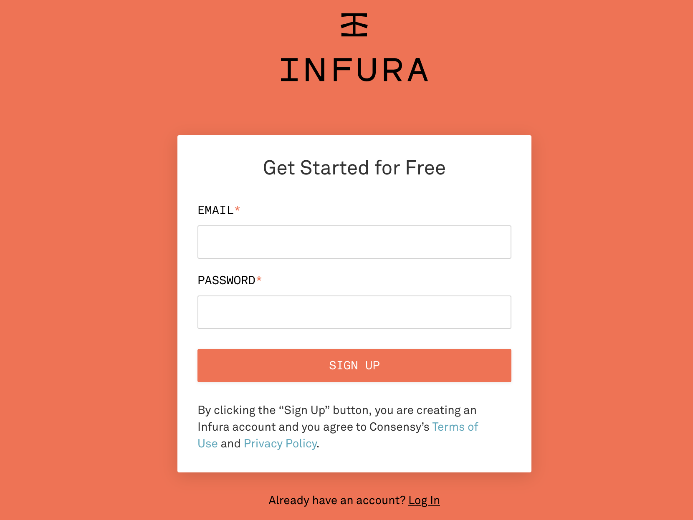
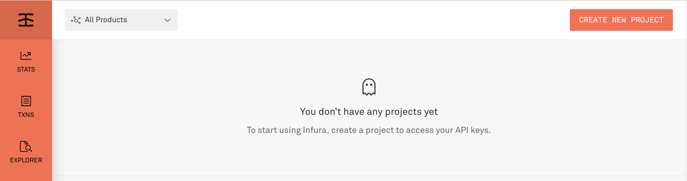
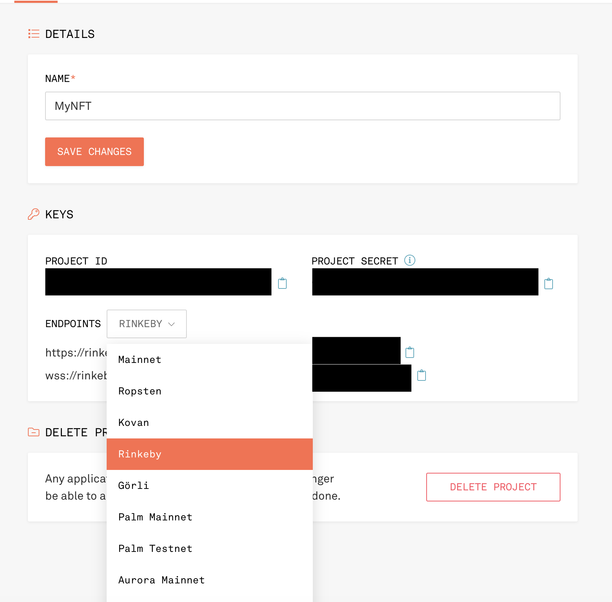
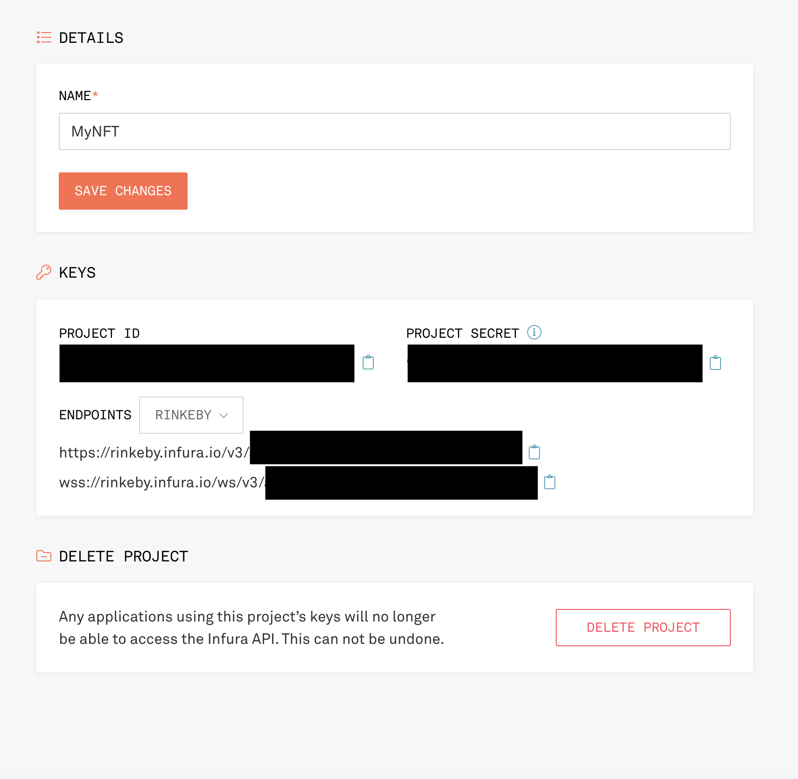

# NFT-Standards

ERC-721 vs ERC-721a vs ERC-1155

We will review different NFT Implementations to help you decide which to use for your project.

Additionally, we will go into how to ensure NFT and contract metadata shows up correctly on Opensea.  We will mint NFTs on various standards, review the gas costs and view the transactions and resulting NFTs.

- [Companion Article](https://blog.infura.io/post/comparing-nft-standards-erc-721-vs-erc-721a-vs-erc-1155)
- [Sign up for a free account with Infura](https://infura.io/register?utm_source=github&utm_medium=devcommunity&utm_campaign=2022_Jul_devrel-sample-projects_content_content).
- [Getting Started with Infura](https://blog.infura.io/post/getting-started-with-infura-28e41844cc89)


## Module 1: Setup

Setting up your local development environment.

### Prerequisites

Basic Setup:

- [NodeJS](https://nodejs.org/en/) version 16 or above
- [Visual Studio Code](https://code.visualstudio.com/)
- [Git Bash](https://git-scm.com/downloads)
- [Bash on VS Code](https://www.shanebart.com/set-default-vscode-terminal/)

Add env config:

```bash
npx yarn add dotenv
```

Add the Infura credentials

```text
# Secret recovery phrase - NEVER EVER SHARE
MNEMONIC= Add your 12 word secret phrase to access your assets on Ethereum. Never share these! Wrap in qoutations.

# Infura Project details
INFURA_PROJECT_SECRET=Add your ID here. (No quotations)

# IPFS Project details
INFURA_IPFS_PROJECT_ID= Add IPFS project id (No qoutations)
INFURA_IPFS_SECRET= Same for IPFS secret (No qoutations)
```

### MetaMask Setup

First, install MetaMask on your browser. If you are already a MetaMask user, it's suggested to create a new browser profile for development purposes and install a separate instance of MetaMask.

See this article to create a [new Chrome profile](https://pureinfotech.com/add-new-user-profiles-google-chrome/), [Firefox](https://www.wikihow.com/Create-a-Firefox-Profile) or [Brave Browser](https://community.brave.com/t/brave-multi-user-accounts/119425).

Go to [https://metamask.io/download/](https://metamask.io/download/)] and choose your browser.

Set up your wallet. **Remember to save your secret recovery phrase in a secure location**. Due to how blockchains are created, the secret recovery phrase CAN NOT be reset. Since MetaMask is a non-custodial wallet, they do not hold a copy for you.

### Infura Setup

Next, you will need to [set up a free account with Infura](https://infura.io/register?utm_source=github&utm_medium=devcommunity&utm_campaign=2022_Jul_devrel-sample-projects_content_content).



Next, select a project. We will create two projects.

First, select Ethereum project.



Choose the Rinkeby Test Network. It' easier to view test net NFTs on this network via OpenSea.



Access your credentials. The project ID can be akin to your username, and the project secret a password.



Next, create a new project and choose IPFS.
You will save both these credentials into an .env file.


### Upload Image data to IPFS

Find a sample image you'd like to upload to IPFS.

You can use the  [Infura IPFS upload tool](https://blog.infura.io/post/ipfs-file-upload-client-tool) to upload images.

Check out the following for more info: [IPFS Client upload article](https://blog.infura.io/post/ipfs-file-upload-client-tool).

Or you can use basic cURL commands.

From your project root, run the follow `curl`command to upload the image. Make sure to modify the `curl` script to add the `Project Secret`and`Project ID` from your **IPFS project**, not your Rinkeby project.

```curl
curl "https://ipfs.infura.io:5001/api/v0/add" \
-X POST \
-F file=@"/img/meme-nft.json" \
-u "<Project-ID>:<Project-Secret>"
```

You will receive something like below. The Hash is the IPFS Content ID (CID) which we will use to identify our asset.

```bash
-X POST \
-F file=@"./img/meme-nft.jpeg" \
-u "<Project-ID>:<Project-Secret>"
{"Name":"meme-nft.jpeg","Hash":"QmW5sPVbZDueZwvSuibteAwDFwFXhF8gebfptGBx1DZq1j","Size":"78353"}
```

#### Install hdwallet-provider

Next, let's add the hierarchical deterministic wallet (HD Wallet). `hdwallet-provider` is a separate package that holds our keys and signs transactions for addresses derived from a 12 or 24-word mnemonic.

Note: that Infura does not manage your private keys. So, it cannot sign transactions on your behalf.

```bash
yarn add @truffle/hdwallet-provider
```

#### OpenZeppelin Contracts

Next up, let's add the OpenZeppelin Contracts. OpenZeppelin is a library for secure smart contract development. It allows developers to build on a solid foundation of community-vetted code.

This is important because smart contracts can hold enormous amounts of value and are immutable.

```bash
npx yarn add @openzeppelin/contracts
```

#### Truffle config

Now, let's configure our Truffle set up. This will allow us to connect Truffle to Infura and access the Ethereum Network.

This particular network, `Rinkeby`, is test network. Test networks are used to deploy contract for testing for free. This allows developers to experiment with contracts conditions that mirror the Ethereum Mainnet where Ether is worth real money.

Open `truffle.config.js` and modify `truffle-config.js` with the following code:

```javascript
// add at the top of truffle-config.js

require("dotenv").config(); // allows usage of .env file to store secrets
const HDWalletProvider = require('@truffle/hdwallet-provider'); // holds secret mnemonic for your Ethereum address
const infuraURL = 'https://rinkeby.infura.io/v3/' + INFURA_PROJECT_ID; // end point to join network
const mnemonic = process.env.MNEMONIC;

//...
// inside networks value
networks: {
    rinkeby: {
      provider: () => new HDWalletProvider(mnemonic, infuraURL),
      network_id: 4, // Rinkeby's id
      gas: 5500000, // Rinkeby has a lower block limit than mainnet
      confirmations: 2, // # of confs to wait between deployments. (default: 0)
      timeoutBlocks: 200, // # of blocks before a deployment times out  (minimum/default: 50)
      skipDryRun: true, // Skip dry run before migrations? (default: false for public nets )
    },
},
//...
// inside compilers
 compilers: {
    solc: {
      version: '0.8.13'
    }
};
```

#### Fund Deployment Account

Finally, let get some free Ether to process transactions on the Rinkeby test network.

Ether is required because:

- Without it, public networks accessible by all would run into DDOS attacks.
- Being able to upload arbitraty logic opens up the network to the the halting problem.
- independent network operators require incentivization to process computation on the network and pay for their operating costs.

Luckily, for our test networks, Ether is free.

Go to [faucet.paradigm.xyz/](https://faucet.paradigm.xyz/) and add your address to claim Rinkeby Ether.

## Module 3: Deployment

Let's now write the script for deployment to the Rinkeby test network.

Navigate to the root of your project directory and create the `2_deployInfura721.js` file.

```bash
touch ./migrations/2_deployInfura721.js
```

The deployment scripts are numbered in the order we wish to deploy them.

Inside `2_deployInfura721.js` add:

```javascript
var InfuraNFT = artifacts.require("InfuraNFT");

module.exports = function (deployer) {
  // deployment steps
  deployer.deploy(InfuraNFT);
};
```

Now we can deploy our contract to Rinkeby test network!

```bash
truffle migrate --network rinkeby
```


You have just completed your first transaction!

Wait until the transactions is finished in about 15 seconds. Then, run the above command again.

```bash
truffle migrate --network rinkeby
```

Replace deployed contract on testnet
```
truffle migrate --reset --network rinkeby
```

### Update .env file

Let's update our `.env` file to account for our NFT metadata:

```text

# Address of the deployed smart contract
CONTRACT_ADDRESS="0x47DC746F41c5dB584e5A6ccf15c2c161560cD0F7"

# Public address to assign NFT mint to
# Use address 1 in your MetaMask account
PUBLIC_ADDRESS="<Public-Address-Of-The-Account-To-Send-NFT-To>"
```

### Module 4: Minting the NFT

#### Creating the Minting script

Let's mint our cool NFT! We will do so in a programmatic way using a minting script.

Create a `/scripts` directory in the project's root directory and enter the said directory.

```bash
mkdir scripts && cd ./scripts
```

Next lets create the `mintSingleNFT.js` script

```bash
touch mintSingleNFT.js
```

##### Finally, lets mint the NFT

Run the following script

```bash
npx truffle exec scripts/mintSingleNFT.js --network rinkeby
```

Once you run the script, wait about 15 to 30 seconds. You should see something similar to:

```bash
Using network 'rinkeby'.

Mining transaction ...
https://rinkeby.etherscan.io/tx/0x6992baf3056a6fd486be3ddbbbef2a0f856e3b8d6f7c988656acf85fe6119754
Success: The NFT has been minted and mined in block 10893060
```

Viola! You have minted a new NFT!

You can check your NFT through various ways:

### View via EtherScan

Via EtherScan: Copy and paste the outputted console message to view the transaction reciept.

#### View via OpenSea

Via OpenSea: Go to [https://testnets.opensea.io/](https://testnets.opensea.io/) and log in with your development MetaMask Account.

#### NFT Metadata for Opensea

Let's create the metadata file

Example metadata:

```javascript
{
  "description": "So Hot, NFT Demo",
  "external_url": "https://spooderman.infura-ipfs.io/ipfs/QmW5sPVbZDueZwvSuibteAwDFwFXhF8gebfptGBx1DZq1j",
  "image": "https://spooderman.infura-ipfs.io/ipfs/QmW5sPVbZDueZwvSuibteAwDFwFXhF8gebfptGBx1DZq1j",
  "name": "MyNFT - So Hot!",
  "background_color": "#FFF"
}
```
